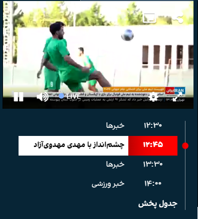

# IranIntl-TimeCorrection

A Chrome extension to adjust the TV schedule displayed on www.iranintl.com.

When you open the Iran International TV website, you’ll see the schedule on the left, but it’s set to Tehran time. If you're outside Iran, it might be confusing to know when the next program will air. This extension corrects the times and shows them based on your local timezone.

### Note:

If you're using a VPN or proxy to access the website, the time will be shown based on your IP address, which may result in incorrect times.

